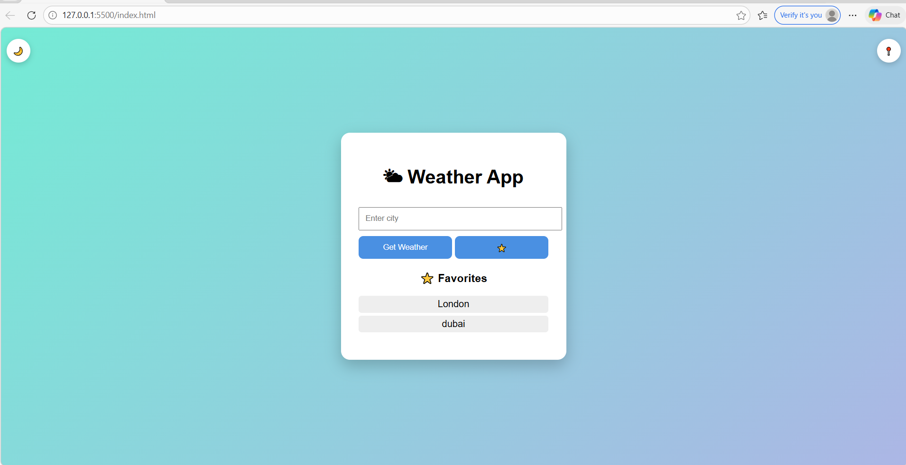
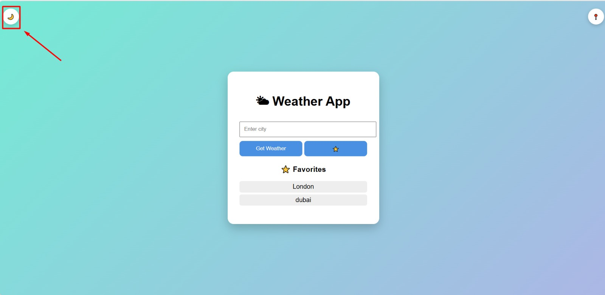
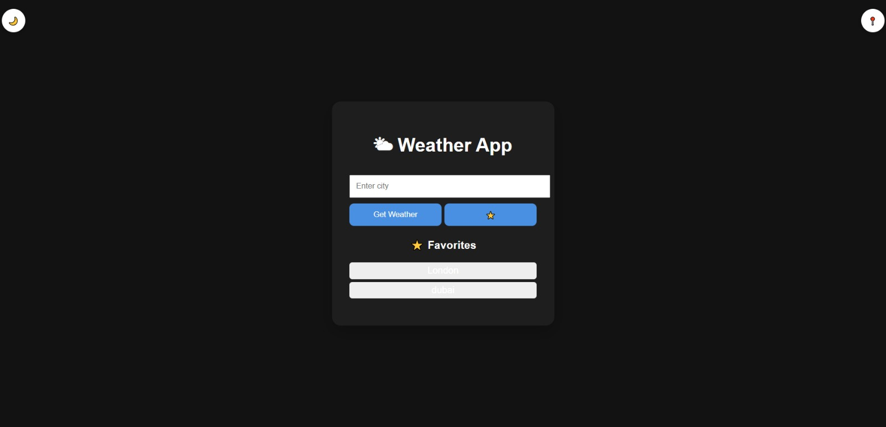
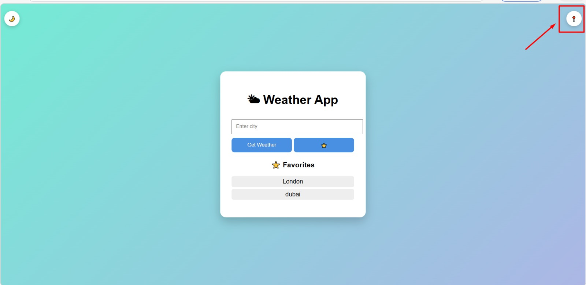
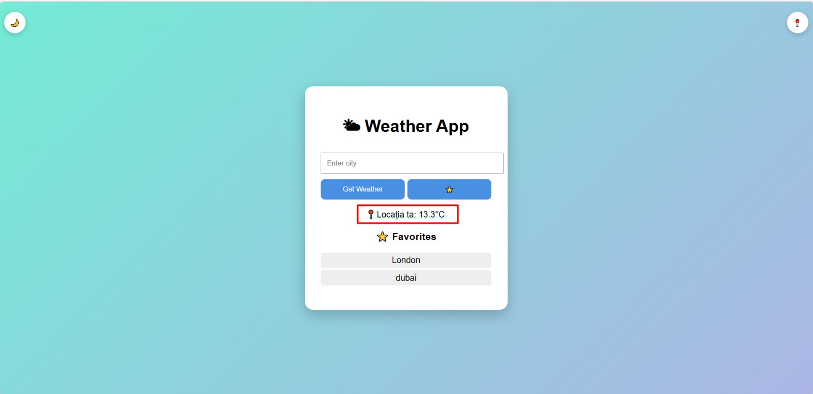
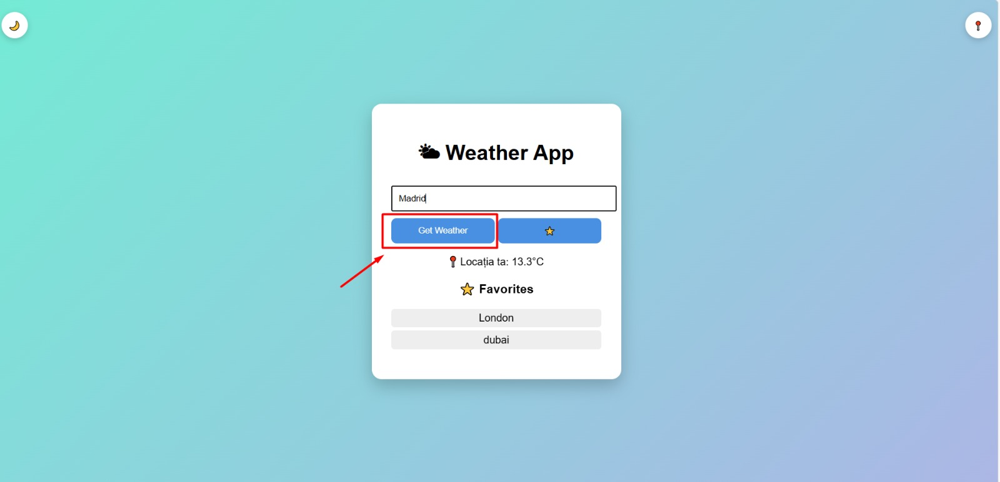
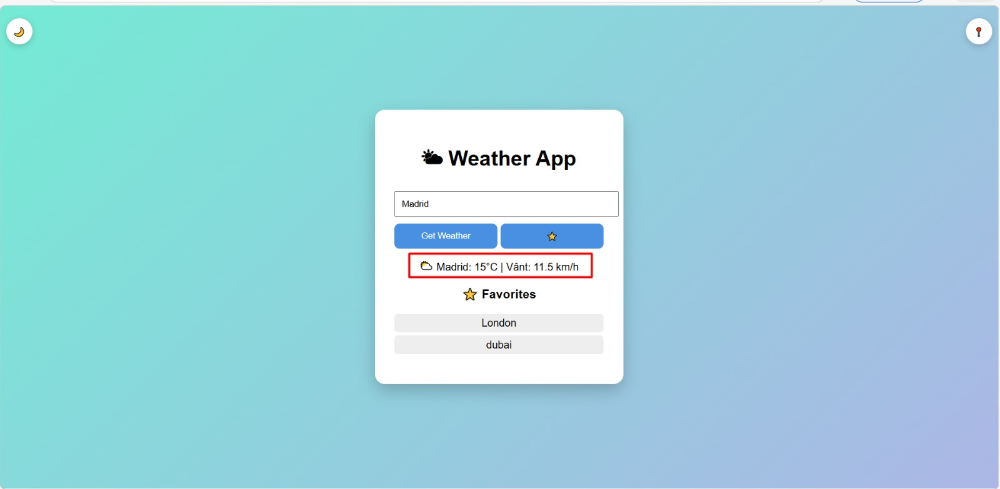
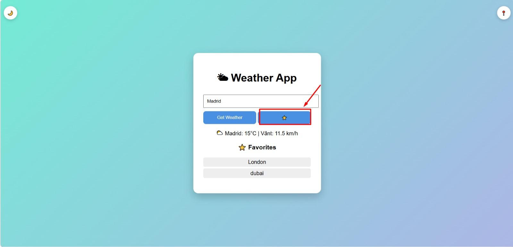
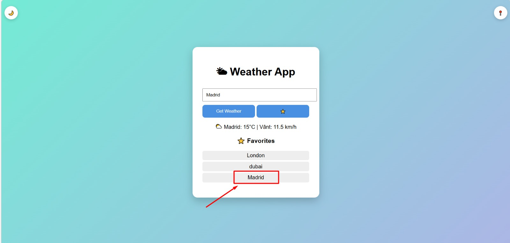

# 🌤 Weather App

**Nume Prenume:Cristian Lorena-Ionela**   
**Grupa:1145** 

## Link aplicație
[Adaugă aici link-ul de pe Vercel / Netlify]

## Video prezentare
[Adaugă aici link YouTube (unlisted)]

## Github
[https://github.com/lorenaionela13/weather-app]

# 1. Introducere

Această aplicație web permite utilizatorilor să afle rapid condițiile meteo pentru un oraș introdus sau pentru locația lor curentă. Aplicația oferă și funcționalități suplimentare precum salvarea orașelor favorite și mod dark/light.

# 2. Descriere problemă

Utilizatorii au nevoie de o modalitate rapidă și intuitivă de a verifica vremea fără a accesa site-uri complexe sau aplicații greoaie. De asemenea, este utilă salvarea orașelor frecvent căutate pentru acces rapid.

# 3. Descriere API

## 🌍 Open-Meteo API
- furnizează date meteo în timp real
- nu necesită API key
- endpoint: https://api.open-meteo.com/v1/forecast

## 📍 Geocoding API (Open-Meteo)
- convertește numele orașului în coordonate geografice
- endpoint: https://geocoding-api.open-meteo.com/v1/search

# 4. Flux de date

## Procesul aplicației:

1. Utilizatorul introduce un oraș
2. Aplicația trimite request către Geocoding API
3. Se obțin coordonatele (latitudine + longitudine)
4. Se trimite request către Weather API
5. Se primește temperatura și viteza vântului
6. Datele sunt afișate în UI

## Exemple de request / response

### Request (Geocoding): GET https://geocoding-api.open-meteo.com/v1/search?name=London

### Response:
{
  "results": [
    {
      "name": "London",
      "latitude": 51.5072,
      "longitude": -0.1276
    }
  ]
}

### Request Weather API: GET https://api.open-meteo.com/v1/forecast?latitude=51.5&longitude=-0.12&current_weather=true

### Response:
{
  "current_weather": {
    "temperature": 12.3,
    "windspeed": 8.5
  }
}

# 5. Capturi ecran aplicație

## Interfața principală

## Buton Night Mode

## Dark mode activ

## Buton locatie actuala

## Locație actuală

## Buton Get Weather

## Afișare vreme Madrid

## Buton Favorite

## Adăugare Madrid la favorite

# 6. Referințe
https://open-meteo.com/
https://open-meteo.com/en/docs/geocoding-api