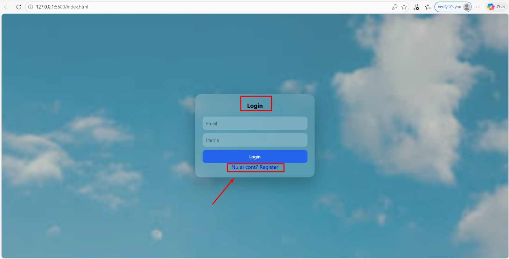
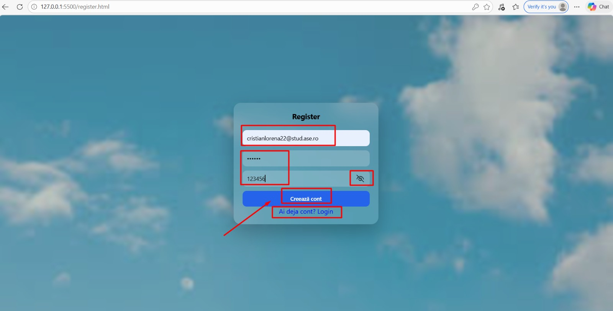
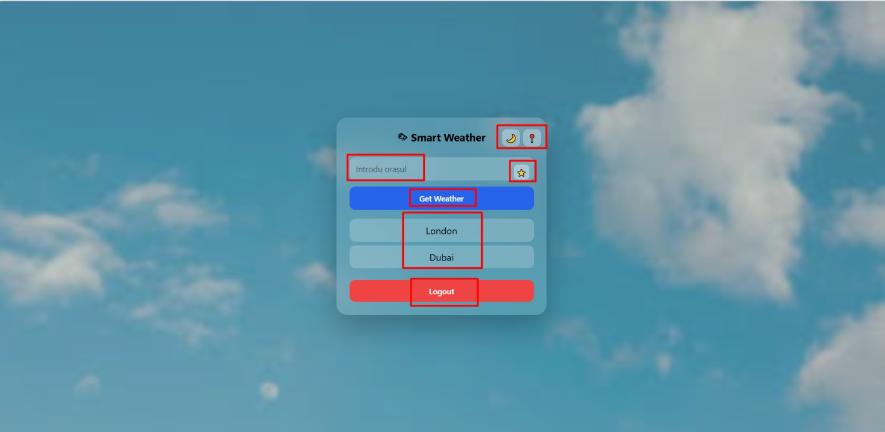
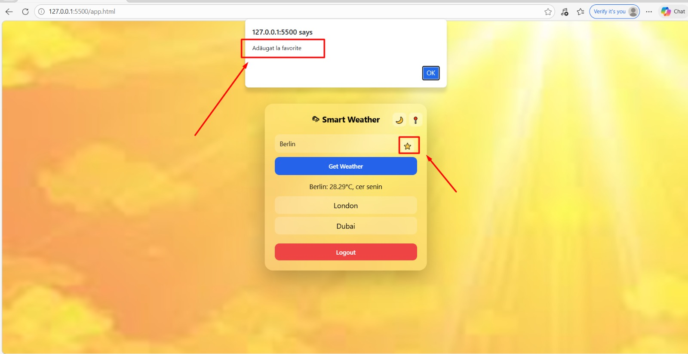
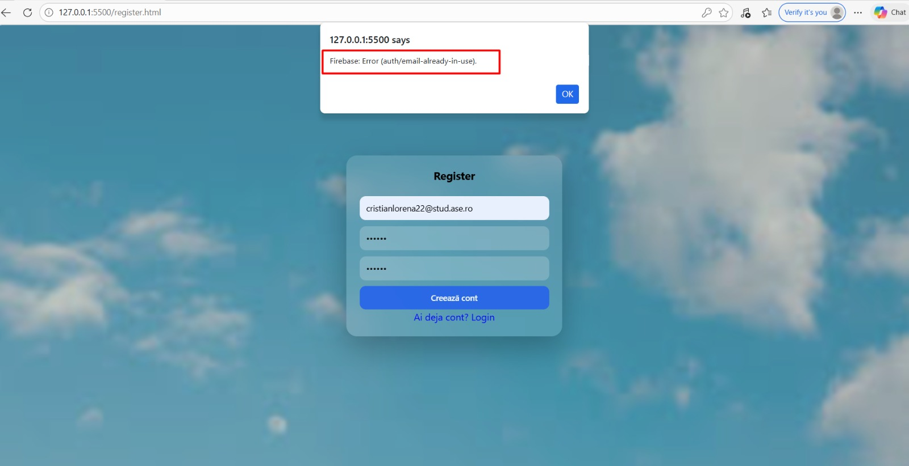
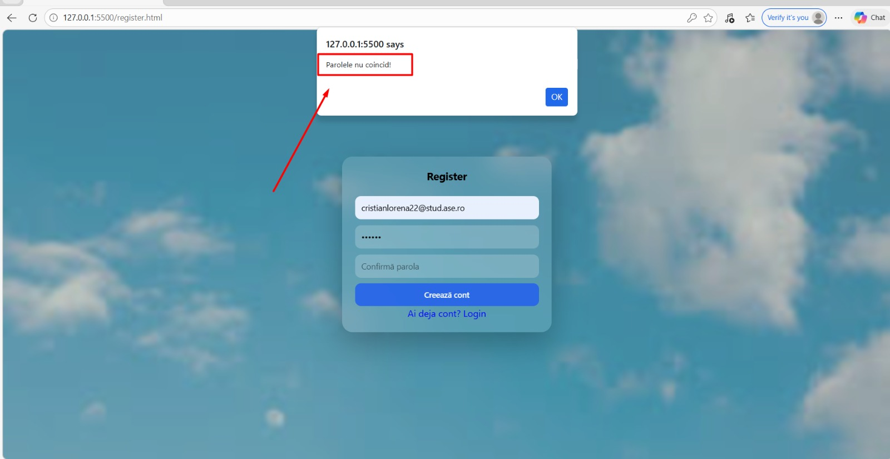
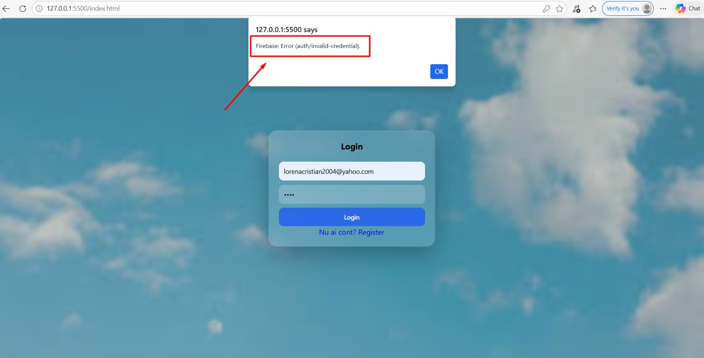

# 🌤 Weather App

**Nume Prenume:Cristian Lorena-Ionela**   
**Grupa:1145** 

## Link aplicație
[https://weather-app-kohl-nine-37.vercel.app/]

## Video prezentare
[Adaugă aici link YouTube (unlisted)]

## Github
[https://github.com/lorenaionela13/weather-app]

# 1. Introducere

Aplicația „Smart Weather” este o aplicație web care permite utilizatorilor să verifice condițiile meteo pentru diferite orașe. Aceasta oferă funcționalități precum autentificare, salvarea orașelor favorite și obținerea locației curente.
Scopul aplicației este de a demonstra utilizarea serviciilor cloud și integrarea acestora într-o aplicație web modernă.

# 2.Tehnologii utilizate:

Aplicația a fost dezvoltată folosind următoarele tehnologii:
HTML5 – pentru structura paginilor
CSS3 – pentru stilizarea interfeței
JavaScript (ES6 Modules) – pentru logică și interactivitate

# Servicii Cloud utilizate:

1.Firebase Authentication:
gestionarea conturilor de utilizator
login / register
persistența sesiunii

2.Firebase Firestore:
stocarea orașelor favorite pentru fiecare utilizator
date salvate în cloud

3.OpenWeather API:
obținerea datelor meteo în timp real

# 3. Funcționalități principale

Aplicația oferă următoarele funcționalități:

Creare cont (register),

Autentificare utilizator (login),

Persistența sesiunii (user rămâne logat după refresh),

Căutare vreme după oraș,

Obținere vreme pe baza locației curente (geolocation),

Salvarea orașelor favorite (per utilizator),

Interfață dinamică (schimbare temă + background în funcție de vreme)

# 4. Descriere API

##  Open-Meteo API
Aplicația utilizează OpenWeather API pentru a obține date meteo în timp real.

Endpoint utilizat: https://api.openweathermap.org/data/2.5/weather

Exemplu Request: GET https://api.openweathermap.org/data/2.5/weather?q=London&appid=API_KEY&units=metric

Exemplu Response:
{
  "name": "London",
  "main": {
    "temp": 15.2
  },
  "weather": [
    {
      "description": "clear sky"
    }
  ]
}

# 5. Flux de date

## Procesul aplicației:

1.Utilizatorul își creează cont sau se loghează

2.După autentificare este redirecționat către aplicația principală

3.Utilizatorul introduce un oraș sau folosește locația curentă

4.Aplicația trimite request către OpenWeather API

5.Datele meteo sunt procesate și afișate în interfață

6.Utilizatorul poate adăuga orașul la favorite

7.Favoritele sunt salvate în Firebase Firestore și încărcate automat la autentificare

# 6. Capturi ecran aplicație

## The main interface

## Register User

## After login

## Buton Night Mode

## Exact location

## Buton Get Weather

## Buton Favorite

## Limiting

## Create an user with already existing credentials

## Use different password for register

## User different password for login

# 7. Concluzie

Aplicația „Smart Weather” demonstrează utilizarea eficientă a tehnologiilor web moderne și integrarea serviciilor cloud.
Prin implementarea autentificării, persistentei datelor și utilizarea unui API extern, aplicația oferă o experiență completă și interactivă utilizatorului.

# 8. Referințe
https://openweathermap.org/api

https://firebase.google.com/